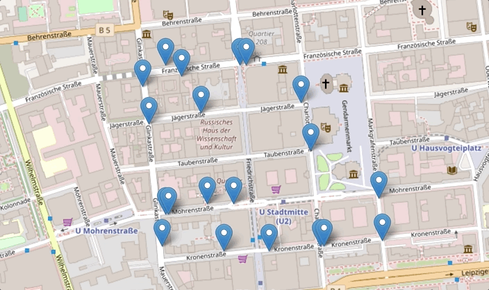

# Fleet simulation

## Introduction
This fleet simulation consists of 3 applications:
* Fleet management - aggregates information from vehicles and shares it with the web app
* Vehicle simulator - runs n vehicles that are moving and sending positions to Fleet every second
* Web app - pings Fleet every second to get update of aggregated state of vehicles

## How to run
```
docker-compose build
docker-compose up
```
The web app requires internet connection to render the map with Open Street Map client.

Please note that vehicles are designed to run without a stop condition, therefore the service needs to be stopped.

Then access [http://localhost:3000](http://localhost:3000) to see the map with live updates

## Preview

